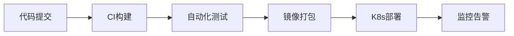

# 网站-介绍

:::warning 温馨提示
本篇为AI生成的介绍，如需查找资源请直接在左侧导航栏中查找或者[前往下一页](/resources/website/map)。
:::

网站就像一座精密运转的数字大厦，每一层都有其独特的 “建筑规范” 和 “施工技术”。从用户眼中的绚丽界面到后台的数据流穿梭，背后是一套协同工作的技术体系，让我们逐层揭开它的神秘面纱。

## 一、前端：用户的 “数字门面”

前端是用户直接接触的层面，相当于大厦的外观设计与内部装修，既要美观又要实用。它由三大核心技术支柱构成，如同建造门面的砖瓦、涂料和装饰：

| 技术核心       | 作用定位   | 关键技术点                                                |
| ---------- | ------ | ---------------------------------------------------- |
| HTML       | 页面骨架搭建 | 语义化标签（`<header>` `<article>`）、DOM 树结构、表单控件           |
| CSS        | 视觉样式定义 | 选择器优先级、Flex/Grid 布局、动画过渡（`@keyframes`）、响应式媒体查询       |
| JavaScript | 交互逻辑实现 | 事件循环机制、DOM 操作 API、异步编程（Promise/async-await）、ES6 + 特性 |

现代前端开发早已进入 “工程化时代”，框架如同预制构件厂，大幅提升建造效率：

*   **React**：以虚拟 DOM 为核心，通过 JSX 语法实现组件化开发，Redux 管理全局状态

*   **Vue**：采用渐进式框架设计，双向数据绑定（v-model）与指令系统简化开发

*   **Angular**：基于 TypeScript 的完整框架，依赖注入与模块化设计支持大型应用

## 二、后端：数据处理的 “中央枢纽”

如果说前端是门面，后端就是大厦的 “机房” 和 “仓库”，负责处理业务逻辑与数据存储。它就像一位全能管家，接收需求、调度资源、返回结果。

### 核心职责与技术栈

后端的核心工作是处理 HTTP 请求，其技术选型呈现多样化特点：

*   **编程语言**：Java（Spring Boot）、Python（Django/Flask）、Node.js（Express）、Go（Gin）

*   **Web 服务器**：Nginx（反向代理 + 负载均衡）、Apache（传统 HTTP 服务）、Tomcat（Java 容器）

*   **API 设计**：遵循 RESTful 规范，通过 URI 定位资源，HTTP 方法定义操作（GET 查询 / POST 创建）

### 安全与性能保障

后端必须建立多重 “防护网”：

*   身份认证：JWT 令牌验证、OAuth2.0 第三方授权

*   权限控制：RBAC（基于角色的访问控制）模型

*   性能优化：接口缓存（Redis）、数据库索引优化、异步任务队列（Celery）

## 三、数据存储：信息的 “数字仓库”

数据是网站的灵魂，存储系统则是保存灵魂的 “保险箱”。根据数据特性不同，仓库类型也各有侧重：

| 存储类型   | 代表产品             | 适用场景      | 核心特性                   |
| ------ | ---------------- | --------- | ---------------------- |
| 关系型数据库 | MySQL、PostgreSQL | 交易系统、用户数据 | 强事务 ACID、SQL 查询、表结构固定  |
| 文档数据库  | MongoDB          | 内容管理、日志存储 | Schema 灵活、JSON 格式、水平扩展 |
| 缓存数据库  | Redis            | 热点数据、会话存储 | 内存存储、高并发、支持多种数据结构      |
| 搜索引擎   | Elasticsearch    | 全文检索、日志分析 | 倒排索引、实时分析、分布式架构        |

数据库优化是性能提升的关键，如同仓库的 “空间规划”：

*   读写分离：主库写入、从库读取，分散压力

*   分库分表：水平拆分（按用户 ID）、垂直拆分（按业务模块）

*   索引设计：B + 树索引加速查询，避免过度索引影响写入性能

## 四、网络通信与部署：连接的 “高速公路”

网站各组件之间通过网络紧密相连，如同大厦的 “管道系统”：

*   **协议层**：TCP 保证可靠传输，HTTP/HTTPS 定义请求格式，WebSocket 实现实时通信

*   **CDN 加速**：静态资源（图片 / JS/CSS）通过边缘节点分发，降低源站压力

*   **容器化部署**：Docker 封装应用环境，Kubernetes 实现自动扩缩容与故障转移

部署流程已进入自动化时代，如同工厂的 “流水线生产”：

从前端的像素级渲染到后端的毫秒级响应，网站技术体系是多学科交叉的产物。每一行代码都在构建更流畅的用户体验，每一次架构优化都在提升系统的稳定性 —— 这正是技术开发的魅力所在。